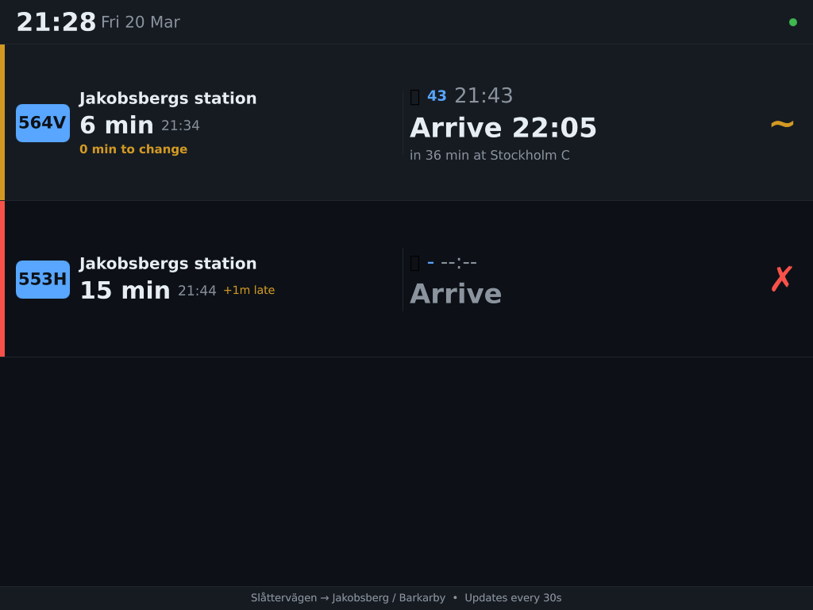
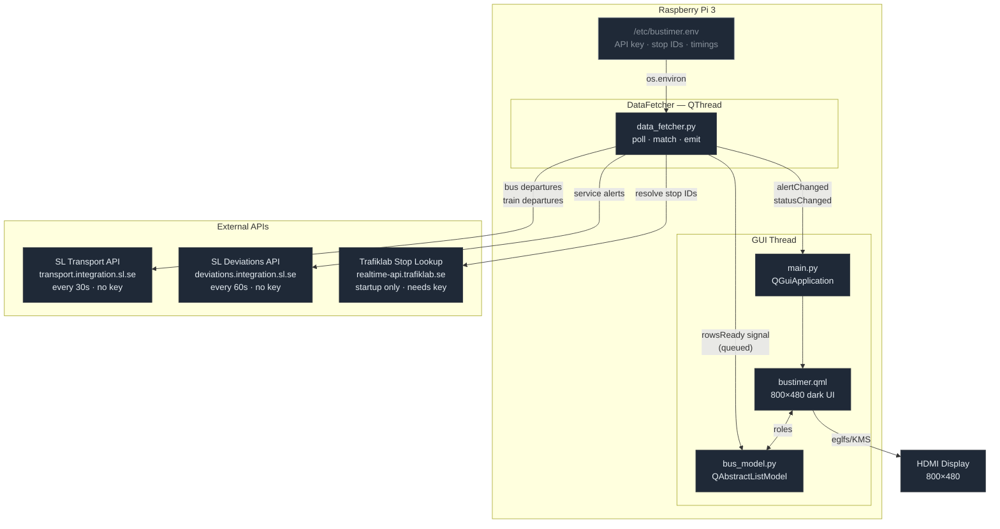

# BusTimer

A fullscreen transit display for Raspberry Pi 3 (800×480).

Answers one question: **"If I take this bus, which train can I catch — and when do I arrive?"**



Shows the next two buses from **Slåttervägen** toward **Jakobsberg / Barkarby** station, each paired with its connecting pendeltåg to Stockholm C, with estimated arrival time and minutes to spare for the change.

---

## Architecture



### Files

| File | Role |
|---|---|
| `main.py` | Entry point. Creates Qt app, loads QML, starts DataFetcher. |
| `bustimer.qml` | UI — 800×480 dark theme, 2 bus rows, clock, alert banner. |
| `data_fetcher.py` | QThread. Polls SL APIs, computes connections, emits rows. |
| `bus_model.py` | QAbstractListModel with 15 roles exposed to QML. |
| `config.py` | Reads all settings from environment variables. |
| `bustimer.env.example` | Template — copy to `/etc/bustimer.env` and fill in values. |
| `bustimer.service` | Systemd unit file. |

---

## Display

```
┌──────────────────────────────────────────────────────────────────┐
│  21:07  Fri 20 Mar                              ● (status dot)   │
├──────────────────────────────────────────────────────────────────┤
│ [553H]  Jakobsbergs station        │ 🚂 43  21:31 +3m            │
│         6 min  21:13               │ Arrive 21:53           ✓   │
│         8 min to change            │ in 46 min at Stockholm C   │
├──────────────────────────────────────────────────────────────────┤
│ [552H]  Jakobsbergs station        │ 🚂 43  21:31 +3m            │
│         11 min  21:18              │ Arrive 21:53           ✓   │
│         4 min to change            │ in 46 min at Stockholm C   │
└──────────────────────────────────────────────────────────────────┘
```

Row colours: **green ✓** (safe margin) / **amber ~** (tight) / **red ✗** (miss)

---

## Connection logic

For each bus departure:

```
arrival_at_station  = bus_expected + BUS_TRAVEL_MINUTES
change_minutes      = train_expected − arrival_at_station
arrive_stockholm    = train_expected + TRAIN_TRAVEL_JAKOBSBERG

status = SAFE   if change_minutes >= TRAIN_BUFFER_MINUTES
       = TIGHT  if change_minutes >= 0
       = MISS   otherwise
```

All times use real-time expected departure (not scheduled), so delays are automatically factored in.

---

## Setup

### 1. Clone and configure

```bash
git clone <repo> bustimer
cd bustimer
cp bustimer.env.example bustimer.env
# Edit bustimer.env — set TRAFIKLAB_API_KEY and review timings
```

### 2. Deploy to Pi

```bash
PI=hatim@pi3.local
KEY=../pi3/id_ed25519_pi3

ssh -i $KEY $PI "mkdir -p ~/bustimer"
scp -i $KEY *.py *.qml *.service requirements.txt $PI:~/bustimer/
scp -i $KEY bustimer.env $PI:/tmp/
ssh -i $KEY $PI "
  sudo cp /tmp/bustimer.env /etc/bustimer.env
  sudo cp ~/bustimer/bustimer.service /etc/systemd/system/
  sudo systemctl daemon-reload
  sudo apt install -y python3-pyqt6 python3-pyqt6.qtquick
  sudo systemctl enable --now bustimer
"
```

### 3. Update an existing deployment

```bash
scp -i $KEY *.py *.qml $PI:~/bustimer/
ssh -i $KEY $PI "sudo systemctl restart bustimer"
```

---

## Configuration reference

All set in `/etc/bustimer.env`:

| Variable | Default | Description |
|---|---|---|
| `TRAFIKLAB_API_KEY` | — | Required for stop ID lookup |
| `BUS_STOP_SITE_ID` | `5838` | Slåttervägen SL site ID |
| `TRAIN_STOP_JAKOBSBERG` | `9702` | Jakobsberg station SL site ID |
| `TRAIN_STOP_BARKARBY` | `9703` | Barkarby station SL site ID |
| `BUS_TRAVEL_MINUTES` | `8` | Slåttervägen → station travel time |
| `TRAIN_BUFFER_MINUTES` | `2` | Minimum change margin for SAFE status |
| `TRAIN_TRAVEL_JAKOBSBERG` | `22` | Jakobsberg → Stockholm C travel time |
| `TRAIN_TRAVEL_BARKARBY` | `18` | Barkarby → Stockholm C travel time |
| `DESTINATION_NAME` | `Stockholm C` | Label shown on screen |

---

## Operations

```bash
# Logs
journalctl -u bustimer -f

# Restart
sudo systemctl restart bustimer

# Stop / start
sudo systemctl stop bustimer
sudo systemctl start bustimer

# Status
sudo systemctl status bustimer
```

### Tuning travel times

If arrival estimates feel off, adjust `BUS_TRAVEL_MINUTES` or `TRAIN_TRAVEL_JAKOBSBERG` in `/etc/bustimer.env` and restart. No code change needed.
